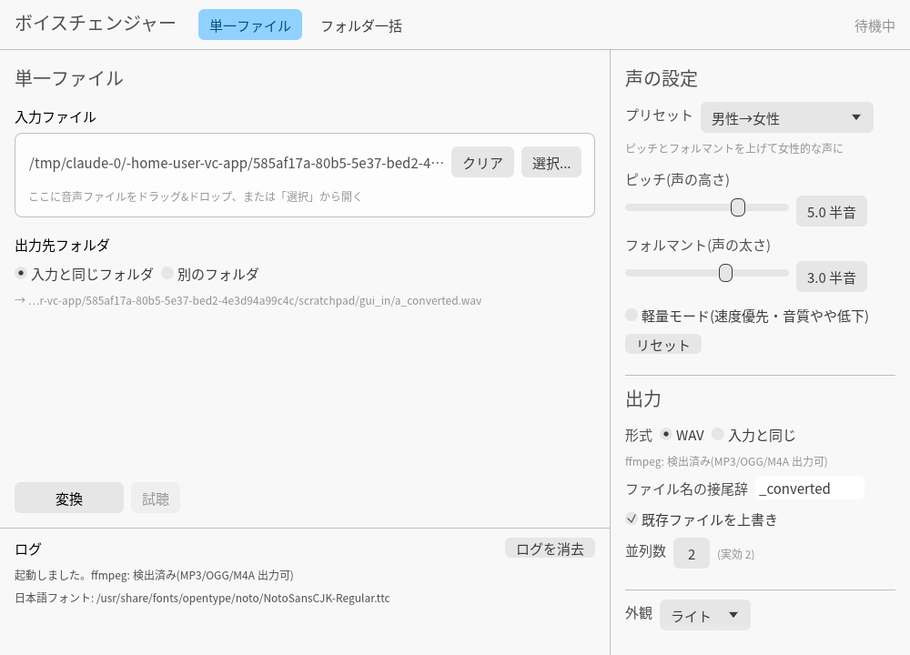
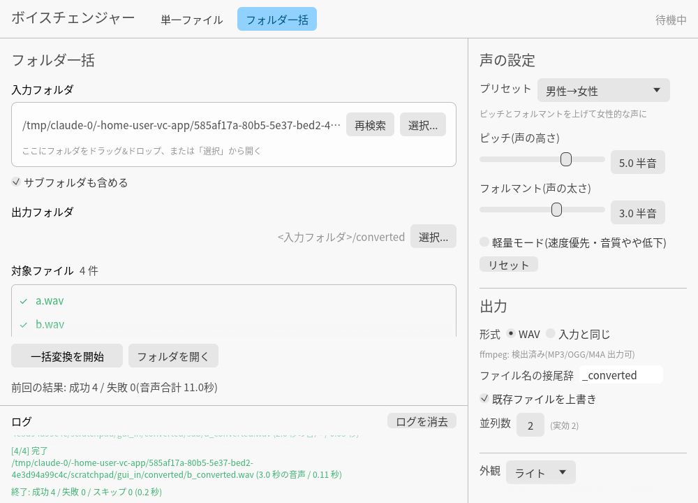

# ボイスチェンジャー(vc_app)

音声ファイルを「別人の声」に聞こえるように加工して出力する Windows 向けデスクトップアプリです。
Rust 製の単一 exe で、ランタイムのインストールは不要です。

- **単一ファイル変換**: 1 つの音声ファイルを選んで変換
- **フォルダ一括変換**: フォルダ内(サブフォルダ含む)の音声ファイルをまとめて変換。CPU の全コアで並列処理
- **ピッチ(声の高さ)とフォルマント(声の太さ)** を半音単位で独立に調整。プリセット付き
- 入力: wav / flac / mp3 / ogg / m4a(aac) / aiff。出力: WAV(既定)または入力と同形式
- ドラッグ&ドロップ、ダーク/ライトテーマ、設定の自動保存、変換結果の試聴
- モデル不要・オフライン・CPU のみ

## スクリーンショット

| 単一ファイル | フォルダ一括 |
|---|---|
|  |  |

## 使い方

1. `vc-app.exe` を起動します。
2. 右側の「声の設定」でプリセット(男性→女性、女性→男性、別人風 など)を選ぶか、スライダーで調整します。
   - **ピッチ**: +12 で 1 オクターブ上。声の高さが変わります。
   - **フォルマント**: 正で小柄・若い印象、負で大柄・低い印象。ピッチとは独立に効きます。
3. **単一ファイル** タブ: ファイルをドラッグ&ドロップ(または「選択…」)→「変換」。
   変換後は「試聴」で確認できます。
4. **フォルダ一括** タブ: フォルダをドラッグ&ドロップ(または「選択…」)→「一括変換を開始」。
   既定では `<入力フォルダ>/converted` に、サブフォルダ構造を保ったまま `元の名前_converted.wav` として保存します。

### 出力形式について

- **WAV**(既定): 16bit PCM。ffmpeg 不要。
- **入力と同じ**: WAV / FLAC はそのまま同形式で保存します。MP3 / OGG / M4A は PATH 上に `ffmpeg` がある場合のみ同形式で保存し、無い場合は WAV で保存してログに表示します。
  `ffmpeg.exe` を `vc-app.exe` と同じフォルダに置いても認識します。

### 設定ファイル

`%APPDATA%\VoiceChanger\settings.json` に保存されます(Linux は `~/.config/voicechanger/`)。壊れていても既定値で起動します。

### 日本語フォント

exe にフォントは同梱せず、起動時に OS の日本語フォント(游ゴシック → メイリオ → MS ゴシックの順)を読み込みます。
見つからない場合は環境変数 `VC_APP_FONT` にフォントファイル(.ttf / .ttc)のパスを設定してください。

## 技術構成

| 役割 | 採用技術 |
|---|---|
| ピッチ / フォルマント変換 | [Signalsmith Stretch](https://github.com/Signalsmith-Audio/signalsmith-stretch)(C++ ヘッダオンリー、MIT)を `vendor/` に同梱し、小さな C シム経由で呼び出し |
| GUI | [egui / eframe](https://github.com/emilk/egui)(純 Rust) + `rfd`(ネイティブダイアログ) |
| デコード | [symphonia](https://github.com/pdeljanov/Symphonia)(純 Rust) |
| エンコード | WAV: `hound`、FLAC: `flacenc`(純 Rust)。MP3 / OGG / M4A は外部 ffmpeg |
| 並列処理 | `rayon` |
| 試聴 | `rodio`(機能フラグ `preview`、既定で有効) |

```
crates/
  vc-core/   ライブラリ + CLI(vc-cli): 音声 I/O、変換エンジン、一括処理、設定
  vc-gui/    GUI(vc-app)
vendor/signalsmith/   同梱した C++ ヘッダ(ライセンスファイル同梱)
```

## 速度

処理の中核は C++(Signalsmith Stretch)で、一括変換は全コアを使います。
開発用コンテナ(4 コア、クラウドの低速 CPU)でのリリースビルド実測値:

<!-- BENCH_START -->
(計測結果は下記「ベンチマーク」コマンドで確認できます)
<!-- BENCH_END -->

一般的なデスクトップ PC ではこれより速くなります。

## ビルド方法(Windows)

1. [Rust](https://rustup.rs/) をインストールします(MSVC ツールチェーン。インストーラの案内に従って Visual Studio Build Tools の「C++ によるデスクトップ開発」を入れてください。C++ シムのコンパイルにも使います)。
2. リポジトリのルートで:

```powershell
cargo build --release
```

3. `target\release\vc-app.exe`(GUI)と `target\release\vc-cli.exe`(CLI)ができます。exe 単体で動作します。

試聴機能を外して少しでも小さくしたい場合:

```powershell
cargo build --release -p vc-gui --no-default-features
```

### Linux / macOS でのビルド

GUI は Linux / macOS でも動きます。Linux では `libasound2-dev`(試聴用)と X11/Wayland の開発ライブラリが必要です。

## CLI(vc-cli)

スクリプトから使ったり、GUI 無しで検証したりできます。

```powershell
# プリセット一覧
vc-cli presets

# 1 ファイル変換
vc-cli convert input.wav --preset 男性→女性
vc-cli convert input.mp3 --pitch -4 --formant -2 --same-format -o out.mp3

# フォルダ一括(サブフォルダ含む、8 並列)
vc-cli batch .\voices --recursive -j 8 --preset "別人風(強め)"

# ベンチマーク(60 秒の合成音声)
vc-cli bench --seconds 60 --files 8
```

## 開発

```powershell
cargo fmt --all
cargo clippy --workspace --all-targets -- -D warnings
cargo test --workspace --profile fastdev
```

テストは合成音声(ビブラート・ジッター・気息ノイズ付きのパルス列を共振器に通したもの)を使い、
ピッチ変更後の基本周波数、フォルマントのみ変更時のピッチ維持、出力の時間位置の一致、
WAV/FLAC/MP3 の読み書き、一括処理のキャンセルや失敗時の継続などを検証します。

GitHub Actions(`.github/workflows/ci.yml`)で Linux のテストと Windows のリリースビルドを行い、
`vc-app.exe` / `vc-cli.exe` を成果物としてダウンロードできます。

## ライセンス

同梱している Signalsmith Stretch / Signalsmith Linear は MIT License です(`vendor/signalsmith/` 内のライセンスファイルを参照)。
